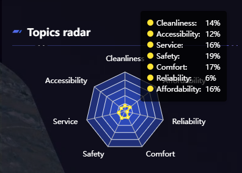

# 雷达图

## 效果 

## 代码

```vue
<template>
  <div class="ec-chart">
    <EcResize :option="ecOption" />
  </div>
</template>

<script lang="ts" setup>
import { computed } from 'vue';

import EcResize from '@sutpc/vue3-ec-resize';
import { scale } from '@sutpc/config';

const props = defineProps({
  list: {
    type: Object,
    default: () => []
  }
});

const MAX_RADAR_VALUE = 100;

const ecOption = computed(() => {
  return {
    color: ['#FFE434'],
    tooltip: {
      textStyle: {
        color: 'white'
      },
      trigger: 'item',
      borderColor: 'rgba(0,0,0,0.3)',
      backgroundColor: 'rgba(0,0,0,0.7)', // 设置为黑色
      formatter: function (param) {
        let result = '';
        const nameArr = [
          'Cleanliness',
          'Accessibility',
          'Service',
          'Safety',
          'Comfort',
          'Reliability',
          'Affordability'
        ];
        for (var j = 0; j < param.value.length; j++) {
          result +=
            '<span style="display:inline-block; width:10px; border-radius: 50%; height:10px; background:' +
            param.color +
            '; margin-right:5px;"></span>';
          result +=
            '<span style="display: inline-block; width: 80px;">' +
            nameArr[j] +
            ':</span>' +
            param.value[j] +
            '%' +
            '<br/>';
        }
        return result;
      }
    },
    radar: {
      radius: '60%',
      axisPointer: {
        label: true
      },
      name: {
        textStyle: {
          color: '#fff',
          fontSize: scale(28) // 设置字体大小
        }
      },
      indicator: [
        { name: 'Cleanliness', max: MAX_RADAR_VALUE },
        { name: 'Accessibility', max: MAX_RADAR_VALUE },
        { name: 'Service', max: MAX_RADAR_VALUE },
        { name: 'Safety', max: MAX_RADAR_VALUE },
        { name: 'Comfort', max: MAX_RADAR_VALUE },
        { name: 'Reliability', max: MAX_RADAR_VALUE },
        { name: 'Affordability', max: MAX_RADAR_VALUE }
      ],
      splitArea: {
        areaStyle: {
          color: [
            'rgba(58, 98, 255, 0.2)',
            'rgba(58, 98, 255, 0.3)',
            'rgba(58, 98, 255, 0.4)',
            'rgba(58, 98, 255, 0.5)',
            'rgba(58, 98, 255, 0.6)',
            'rgba(58, 98, 255, 0.7)',
            'rgba(58, 98, 255, 0.8)'
          ].reverse()
        }
      }
    },
    series: [
      {
        name: '评分',
        type: 'radar',
        data: [
          {
            name: 'Topics radar',
            value: props.list.map((i) => i.topicProportion)
          }
        ]
      }
    ]
  };
});
</script>

<style lang="less" scoped>
.ec-chart {
  position: relative;
  height: 507px;
}
</style>


```